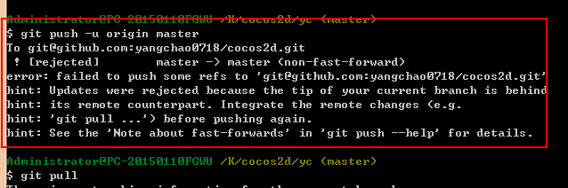
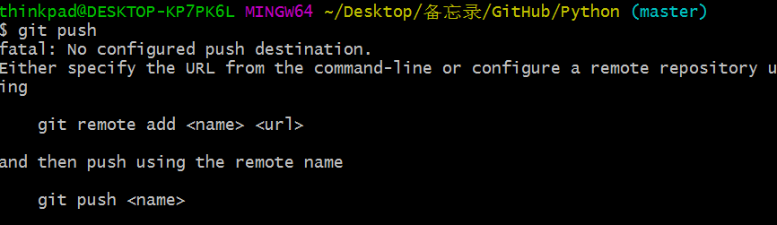

### 如何解决failed to push some refs to git 

- 最近刚学习git，在使用git的过程中对本地文件push到GitHub时会出错。首先说一下我出现的原因  
  - 我在GitHub以GUI的方式创建了一个仓库，在本地创建了一个文件夹，在文件夹中写了一个md文件，想把这个文件提交到我的对应的远程仓库上。但是在这其中出现了一些问题。
  - 首先没有初始化仓库（`git init`）导致push的时候出现很多exe文件
  - 其次没有建立远程与本地的联系
  `git remote -v`——查看本地与远程的联系
  `git remote add origin https://github.com/nana0908/Python` ——与远程仓库建立关联关系，origin为URL的别名，代表后面的URL，之后可以用`origin`代替`https://github.com/nana0908/Python`。
  - 然后`git commit`和`git pull`、`git push -u origin master`提交。
  - 在提交的时候会出现failed to push some refs to git的错误提示，如：
  或者  
  出现错误的主要原因是github中的README.md文件不在本地代码目录中，解决方法是通过`git pull --rebase origin master`命令将代码合并（注：pull=fetch+merge），执行上面代码后可以看到本地代码库中多了`README.md`文件，此时再执行语句` git push -u origin master`即可完成代码上传到github.
  